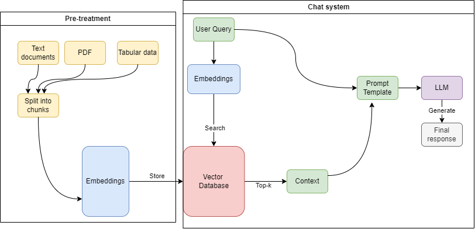

# Polytech Assistant (Retrieval augmented generation)

## Pipeline architecture

The proposed solution consists of a two-part pipeline designed to address the challenges identified in integrating Large Language Models (LLMs) with localized and heterogeneous typed polytech data for natural language query response.

The first component of the pipeline involves pre-treatment of data. Here, we employ web scraping techniques to gather textual data from various websites and import the provided structured data (such as tabular and CSV formats), and PDF documents . Subsequently, we transform this diverse array of source data into embeddings, encoding them for storage within our vector database. This preprocessing step ensures that the data is efficiently organized and accessible for subsequent query processing.

The second part of the pipeline focuses on the chat system architecture. When a user submits a natural language query, it undergoes an embedding transformation to convert the query into a structured representation. Leveraging the Fast Approximate Nearest Neighbor Search (FAISS) algorithm, we retrieve the top-k most relevant data contexts from the vector store with logarithmic complexity (the choice of k is based on performance comparison tests). This approach enables fast comparison of similarity between query embeddings and stored data embeddings, facilitating efficient retrieval of pertinent information.

Upon retrieving the relevant data context, both the query and context are injected into a predefined prompt template. This template, tailored to suit the characteristics of LLMs and ensures that the LLM only respond based on the context, serves as input to the language model to generate the final response to the user query. Through this process, we ensure that the response provided by the LLM is contextually relevant and effectively addresses the user's inquiry based on the localized polytech data.

By implementing this proposed solution, we aim to enhance the capabilities of LLMs in responding to natural language queries regarding polytech data that includes heterogeneous types of data while maintaining data localization and ensuring efficient query response mechanisms.
